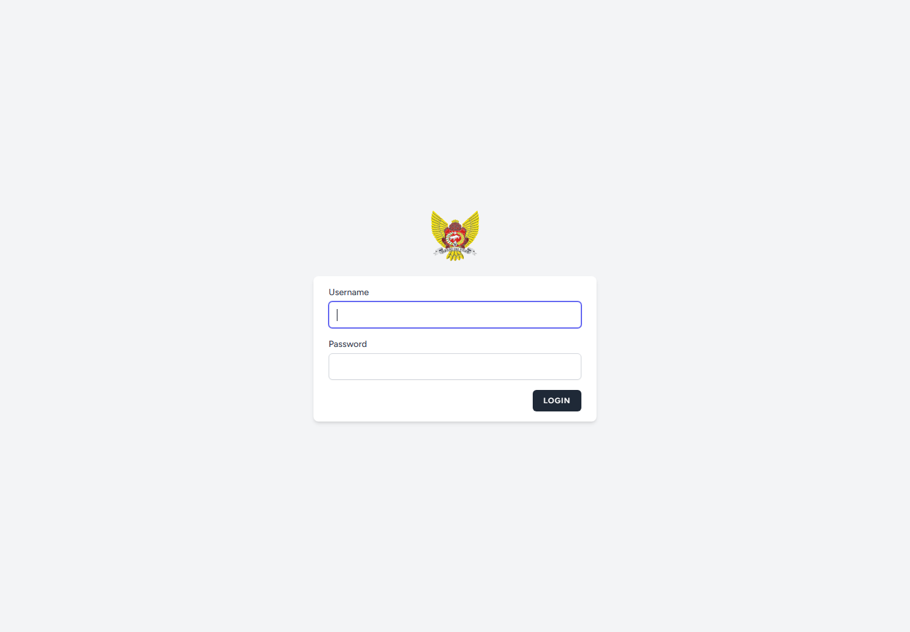
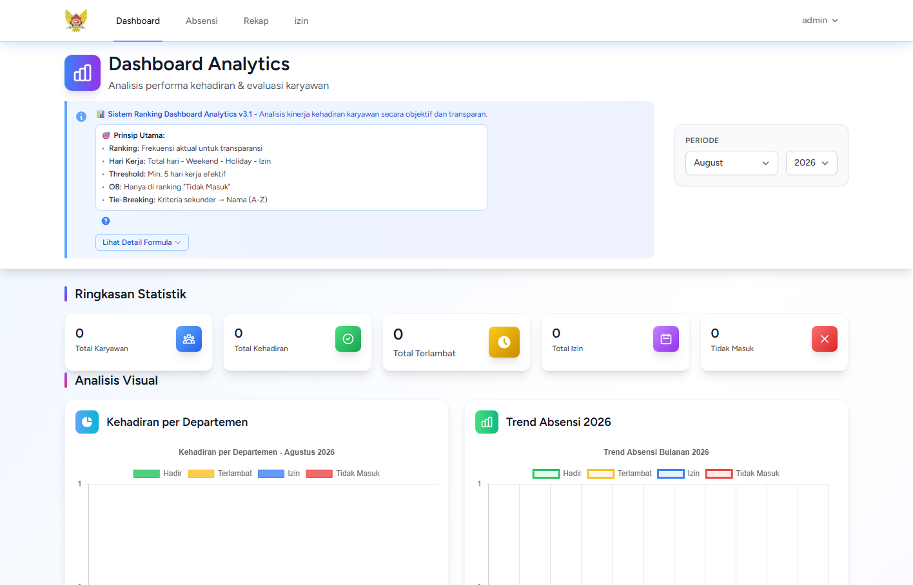
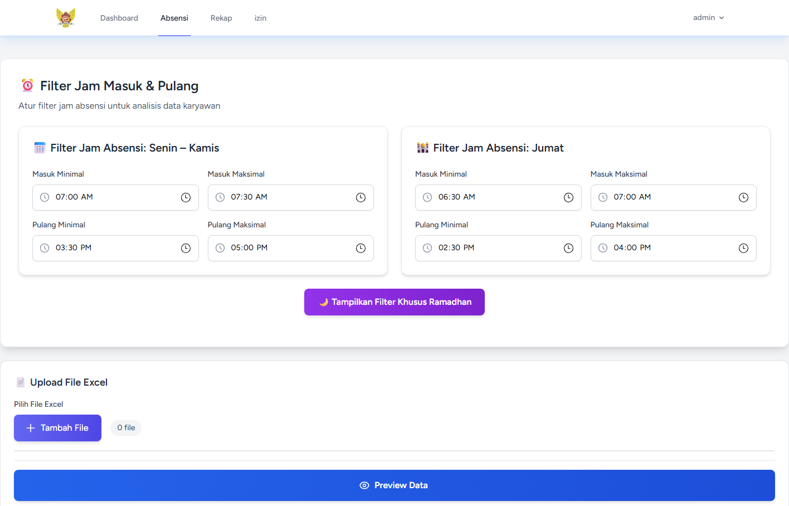
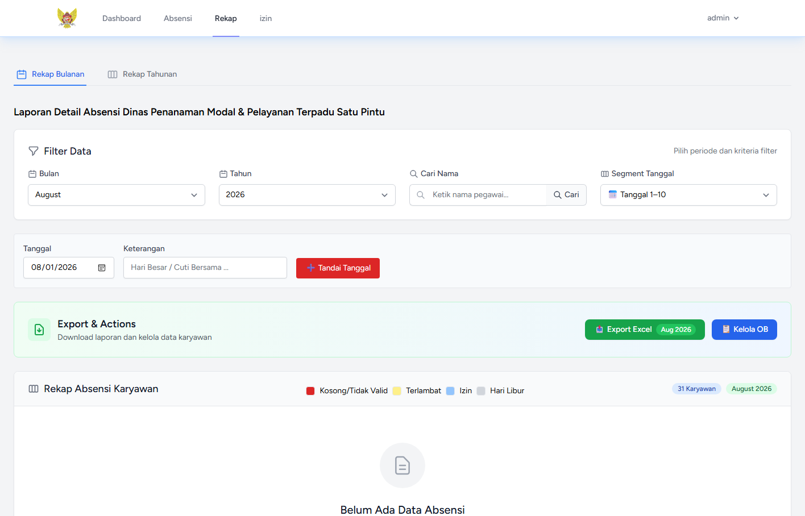
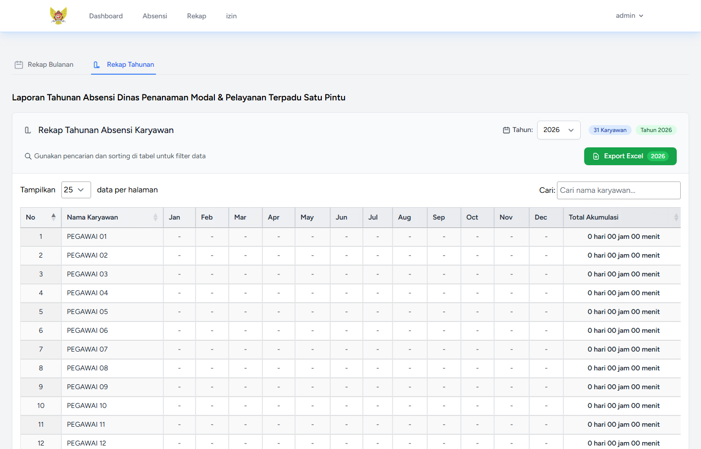
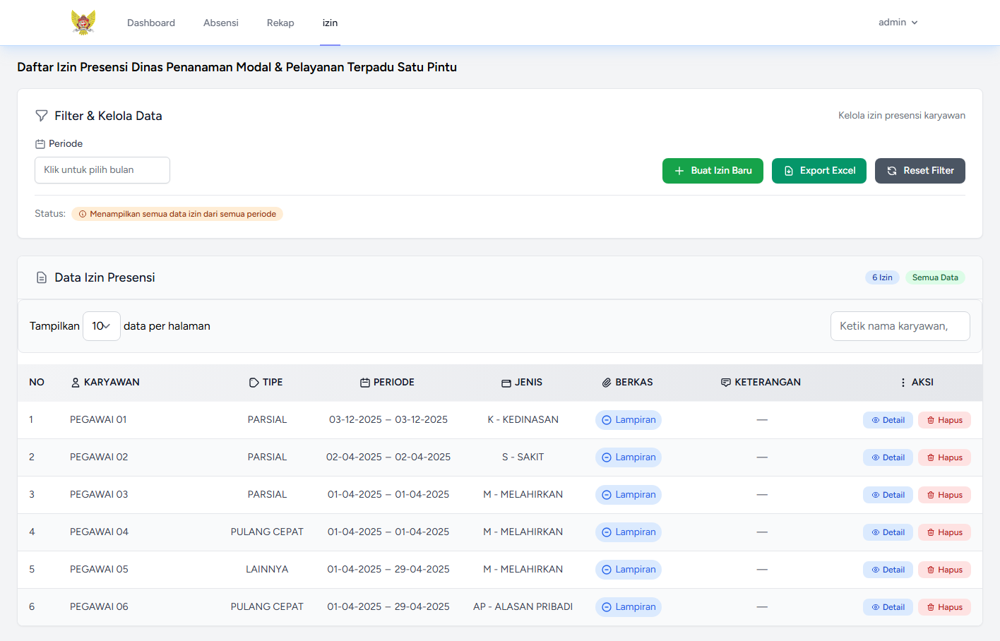

<p align="center">
  
</p>

# Sistem Rekap Absensi DPMPTSP Kota Kediri

Aplikasi web untuk mengelola dan merekap data kehadiran pegawai Dinas Penanaman Modal dan Pelayanan Terpadu Satu Pintu (DPMPTSP) Kota Kediri. Aplikasi ini mendukung impor data absensi dari Excel, pencatatan izin, analisis kehadiran, serta ekspor rekap bulanan dan tahunan.

## Fitur Utama

- Autentikasi pengguna dan penggantian kata sandi.
- Impor serta pratinjau data absensi dari berkas `.xlsx` atau `.xls`.
- Penentuan status kehadiran berdasarkan rentang jam kerja normal dan Ramadan.
- Pengelolaan data karyawan aktif dan nonaktif.
- Pencatatan izin presensi beserta lampiran.
- Rekap absensi bulanan dan tahunan.
- Pengelolaan hari libur dan data petugas OB.
- Dashboard analitik kehadiran per departemen.
- Ekspor rekap absensi dan izin ke Excel.

## Tampilan Aplikasi

### Halaman Login



### Dashboard Analitik



### Impor Data Absensi



### Rekap Absensi Bulanan



### Rekap Absensi Tahunan



### Izin Presensi



> Nama pegawai dan keterangan pada screenshot telah dianonimkan untuk menjaga privasi data.

## Teknologi

- PHP 8.2+
- Laravel 12
- MySQL/MariaDB
- Blade, Alpine.js, dan Tailwind CSS
- Vite 6
- Chart.js dan DataTables
- Laravel Excel dan DomPDF

## Prasyarat

Pastikan perangkat telah memiliki:

- [Git](https://git-scm.com/)
- [PHP](https://www.php.net/) 8.2 atau lebih baru beserta ekstensi yang diminta Composer
- [Composer](https://getcomposer.org/)
- [Node.js](https://nodejs.org/) dan npm
- MySQL atau MariaDB

## Instalasi

1. Kloning repositori dan masuk ke direktori proyek.

   ```bash
   git clone https://github.com/shuriza/rekap_absensi.git
   cd rekap_absensi
   ```

2. Instal dependensi backend dan frontend.

   ```bash
   composer install
   npm install
   ```

3. Salin konfigurasi environment.

   Windows PowerShell:

   ```powershell
   Copy-Item .env.example .env
   ```

   Linux/macOS:

   ```bash
   cp .env.example .env
   ```

4. Buat database, lalu sesuaikan konfigurasi berikut di `.env`.

   ```dotenv
   DB_CONNECTION=mysql
   DB_HOST=127.0.0.1
   DB_PORT=3306
   DB_DATABASE=rekap_absensi
   DB_USERNAME=root
   DB_PASSWORD=
   ```

5. Buat application key, tabel database, data awal, dan symbolic link penyimpanan.

   ```bash
   php artisan key:generate
   php artisan migrate --seed
   php artisan storage:link
   ```

## Menjalankan Aplikasi

Jalankan kedua proses berikut pada terminal terpisah.

Terminal pertama:

```bash
php artisan serve
```

Terminal kedua:

```bash
npm run dev
```

Buka `http://127.0.0.1:8000/login` melalui browser.

## Akun Awal

Seeder menyediakan akun administrator berikut:

```text
Username: admin
Password: admin123
```

Segera ganti kata sandi setelah login, terutama jika aplikasi akan digunakan di luar lingkungan lokal.

## Pengujian

Jalankan seluruh pengujian dengan:

```bash
composer test
```

## Build Produksi

Kompilasi aset frontend untuk produksi dengan:

```bash
npm run build
```
